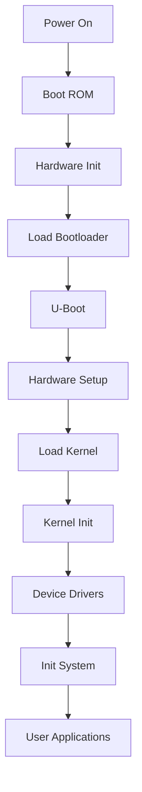

# Boot Process Overview

## What is the Boot Process?

The boot process in embedded Linux systems is the sequence of operations that occur from power-on reset until the operating system is fully loaded and ready to execute user applications. It's a critical phase that determines system reliability, security, and performance.

### Key Components

- **Boot ROM**: Hardware-level initialization code stored in read-only memory
- **Bootloader**: Software that loads and configures the operating system
- **Kernel**: The core of the Linux operating system
- **Init System**: The first user-space process that starts all other processes

## Why is the Boot Process Important?

### System Reliability

- **Predictable Startup**: Ensures consistent system initialization every time
- **Error Recovery**: Provides mechanisms to recover from boot failures
- **Hardware Validation**: Verifies that all critical hardware components are functional

### Security

- **Secure Boot**: Validates the integrity and authenticity of boot components
- **Chain of Trust**: Establishes trust from hardware to operating system
- **Tamper Detection**: Identifies unauthorized modifications to boot components

### Performance

- **Fast Boot**: Minimizes time from power-on to operational state
- **Resource Optimization**: Efficiently allocates system resources during startup
- **Boot Time Analysis**: Enables measurement and optimization of boot performance

## When Does the Boot Process Occur?

### Power-On Scenarios

- **Cold Boot**: Complete system startup from power-off state
- **Warm Boot**: Restart without full power cycle
- **Reset**: System reset due to error or user command
- **Wake from Sleep**: Resume from low-power sleep state

### Boot Triggers

- **Power Button**: Manual system startup
- **RTC Alarm**: Scheduled wake-up from real-time clock
- **External Signal**: Wake from external hardware trigger
- **Network Boot**: Boot from network server (PXE, TFTP)

## Where Does the Boot Process Happen?

### Hardware Locations

- **Boot ROM**: On-chip read-only memory containing initial boot code
- **Flash Memory**: External non-volatile storage for bootloader and kernel
- **RAM**: Temporary storage for boot process execution
- **CPU Registers**: Hardware configuration and control registers

### Memory Layout

```
0x00000000 - 0x0000FFFF: Boot ROM
0x00010000 - 0x000FFFFF: Bootloader
0x00100000 - 0x00FFFFFF: Kernel Image
0x01000000 - 0xFFFFFFFF: Root Filesystem
```

## How Does the Boot Process Work?

### Stage 1: Boot ROM Execution

The boot process begins when the CPU executes code from the Boot ROM:

```c
// Boot ROM initialization sequence
void boot_rom_init(void) {
    // Initialize CPU core
    cpu_core_init();

    // Configure memory controller
    memory_controller_init();

    // Initialize basic peripherals
    uart_init();
    gpio_init();

    // Load bootloader from flash
    load_bootloader();
}
```

### Stage 2: Bootloader Execution

The bootloader performs hardware initialization and loads the kernel:

```c
// U-Boot main initialization
int uboot_main(void) {
    // Initialize hardware
    board_init();

    // Configure memory
    memory_setup();

    // Load kernel image
    if (load_kernel() != 0) {
        printf("Failed to load kernel\n");
        return -1;
    }

    // Set up kernel parameters
    setup_kernel_args();

    // Jump to kernel
    jump_to_kernel();

    return 0;
}
```

### Stage 3: Kernel Initialization

The Linux kernel initializes system components:

```c
// Kernel startup sequence
asmlinkage void start_kernel(void) {
    // Initialize architecture-specific code
    setup_arch();

    // Initialize memory management
    mm_init();

    // Initialize process management
    sched_init();

    // Initialize device drivers
    driver_init();

    // Start init process
    init_process();
}
```

### Stage 4: Init System

The init system starts user-space processes:

```bash
#!/bin/sh
# Init system startup script

# Mount filesystems
mount -a

# Start system services
/etc/init.d/rcS

# Start user applications
/etc/init.d/rc.local
```

## Boot Process Flow Diagram



## Boot Configuration

### U-Boot Environment Variables

```bash
# Boot configuration
bootargs=console=ttyS0,115200 root=/dev/mmcblk0p2 rw
bootcmd=mmc read 0x1000000 0x2000 0x4000; bootm 0x1000000
bootdelay=3
baudrate=115200
```

### Device Tree Configuration

```dts
// Boot configuration in device tree
/ {
    chosen {
        bootargs = "console=ttyS0,115200 root=/dev/mmcblk0p2 rw";
        linux,initrd-start = <0x1000000>;
        linux,initrd-end = <0x2000000>;
    };

    memory {
        device_type = "memory";
        reg = <0x0 0x40000000>;
    };
};
```

## Boot Time Optimization

### Techniques for Faster Boot

1. **Parallel Initialization**: Initialize multiple components simultaneously
2. **Lazy Loading**: Defer non-critical component initialization
3. **Compressed Images**: Use compressed kernel and filesystem images
4. **Fast Boot Mode**: Skip unnecessary hardware checks

### Boot Time Measurement

```c
// Boot time measurement
static unsigned long boot_start_time;
static unsigned long boot_end_time;

void boot_time_start(void) {
    boot_start_time = get_timer(0);
}

void boot_time_end(void) {
    boot_end_time = get_timer(0);
    printf("Boot time: %lu ms\n", boot_end_time - boot_start_time);
}
```

## Error Handling and Recovery

### Boot Failure Scenarios

1. **Hardware Failure**: Critical hardware component malfunction
2. **Corrupted Images**: Damaged bootloader or kernel images
3. **Configuration Error**: Incorrect boot parameters
4. **Memory Issues**: Insufficient or corrupted memory

### Recovery Mechanisms

```c
// Boot recovery mechanism
int boot_recovery(void) {
    // Try to load backup kernel
    if (load_backup_kernel() == 0) {
        printf("Using backup kernel\n");
        return 0;
    }

    // Try to load from different storage
    if (load_from_network() == 0) {
        printf("Booting from network\n");
        return 0;
    }

    // Enter recovery mode
    printf("Entering recovery mode\n");
    recovery_mode();

    return -1;
}
```

## Practical Example: Rock 5B+ Boot Process

### Hardware Configuration

```c
// Rock 5B+ specific boot configuration
void rock5b_boot_init(void) {
    // Initialize ARM Cortex-A76 cores
    arm_core_init();

    // Configure DDR4 memory
    ddr4_init();

    // Initialize eMMC/SD card interface
    emmc_init();

    // Set up UART for console output
    uart_init();

    // Configure GPIO for boot mode selection
    gpio_boot_mode_init();
}
```

### Boot Sequence

1. **Power On**: System receives power and reset signal
2. **Boot ROM**: ARM Cortex-A76 executes Boot ROM code
3. **Hardware Init**: Memory, peripherals, and interfaces initialized
4. **Bootloader Load**: U-Boot loaded from eMMC/SD card
5. **U-Boot Execution**: Hardware setup and kernel loading
6. **Kernel Boot**: Linux kernel initialization and device driver loading
7. **Init System**: User-space initialization and application startup

## Best Practices

### Boot Process Design

1. **Modular Design**: Separate boot stages for easier debugging
2. **Error Handling**: Implement comprehensive error detection and recovery
3. **Logging**: Provide detailed boot logs for troubleshooting
4. **Configuration**: Use flexible configuration mechanisms

### Security Considerations

1. **Secure Boot**: Implement hardware-based secure boot
2. **Image Verification**: Verify integrity of boot components
3. **Access Control**: Restrict access to boot configuration
4. **Audit Trail**: Maintain logs of boot process events

## Troubleshooting Common Issues

### Boot Hangs

- **Check Hardware**: Verify power supply and connections
- **Review Logs**: Examine boot logs for error messages
- **Test Components**: Verify individual hardware components
- **Configuration**: Check boot parameters and configuration

### Slow Boot Times

- **Profile Boot Process**: Measure time spent in each stage
- **Optimize Images**: Use compressed and optimized images
- **Parallel Init**: Initialize components in parallel where possible
- **Remove Unnecessary**: Eliminate non-essential boot components

## Conclusion

The boot process is a critical component of embedded Linux systems that determines system reliability, security, and performance. Understanding the boot sequence, implementing proper error handling, and optimizing boot times are essential skills for embedded Linux developers. By following best practices and implementing robust recovery mechanisms, developers can create reliable and efficient embedded systems that meet the demanding requirements of modern applications.

## Further Reading

- [U-Boot Documentation](https://www.denx.de/wiki/U-Boot)
- [Linux Kernel Boot Process](https://www.kernel.org/doc/html/latest/)
- [ARM Boot Process](https://developer.arm.com/documentation)
- [Embedded Linux Boot Process](https://elinux.org/Boot_Process)
